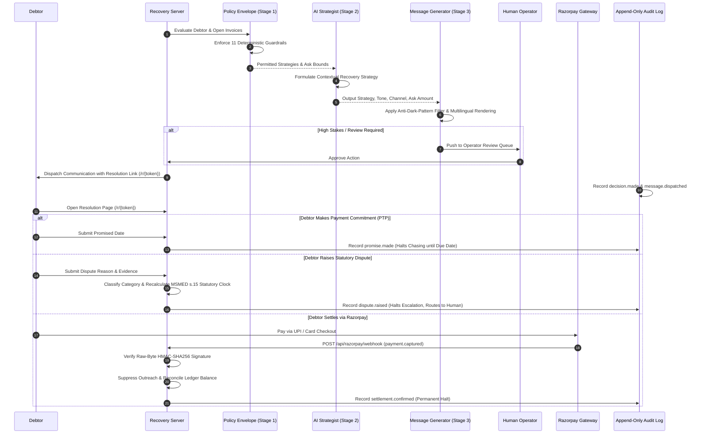

# PayUpPal: Technical Architecture & Systems Design

An autonomous, legally grounded, and relationship-aware B2B receivables recovery engine built on Razorpay APIs, India MSMED statutory frameworks, and Gemini LLM reasoning.

---

## 1. System Architecture Overview

```
                                  +---------------------------------------+
                                  |         Accounts Ledger (ERP)         |
                                  |  (Invoices, Debtors, Supplier Udyam)  |
                                  +-------------------+-------------------+
                                                      |
                                                      v
                                  +---------------------------------------+
                                  |      Stage 1: Deterministic Policy    |
                                  |          Hard Safety Envelope         |
                                  |  (11 Guardrails, Strategy Exclusion,  |
                                  |   Concession Bounds, Cooldown Gates)  |
                                  +-------------------+-------------------+
                                                      |
                                     Permitted Action Space & Context
                                                      v
+-----------------------------+   +---------------------------------------+
|  Model Failover Chain       |   |       Stage 2: AI Recovery            |
|  - gemini-3.6-flash (Pri)   |<->|             Strategist                |
|  - gemini-3.5-flash         |   |  (Debtor Persona, Habitual Lateness,  |
|  - gemini-3.5-flash-lite    |   |   Commercial vs Statutory Strategy)   |
|  - gemini-3.1-flash-lite    |   +-------------------+-------------------+
+-----------------------------+                       |
                                          Structured Decision Payload
                                                      v
                                  +---------------------------------------+
                                  |      Stage 3: Message Generation      |
                                  |      & Anti-Dark-Pattern Filter       |
                                  |  (Tone, English/Hinglish, Razorpay    |
                                  |   Resolution URL, Statutory Copy)     |
                                  +-------------------+-------------------+
                                                      |
                         +----------------------------+----------------------------+
                         |                                                         |
                         v                                                         v
        +----------------------------------+                     +----------------------------------+
        |     Review-First High-Stakes     |                     |    Direct Automated Dispatch     |
        |       Human Operator Queue       |                     |   (Email / WhatsApp / Portal)    |
        +----------------+-----------------+                     +-----------------+----------------+
                         |                                                         |
                         v (Approved)                                              |
                         +----------------------------+----------------------------+
                                                      |
                                                      v
                                  +---------------------------------------+
                                  |        Debtor Multi-Door Surface      |
                                  |               (/r/{token})            |
                                  |  [Pay Razorpay] [Promise] [Dispute]   |
                                  +-------------------+-------------------+
                                                      |
                                                      | Webhook (payment.captured)
                                                      v
                                  +---------------------------------------+
                                  |       Razorpay Gateway & Webhook      |
                                  |       Suppression-on-Settlement       |
                                  |  (Raw-byte HMAC, Idempotent Capture,  |
                                  |   Instant Ladder Halt, Audit Trail)   |
                                  +---------------------------------------+
```

### Mermaid Sequence & Data Flow



---

## 2. Component Specifications

### Stage 1: Deterministic Policy Envelope (`app/envelope.py`)

The deterministic policy envelope is the immutable safety harness of the recovery agent. The AI model is never allowed unconstrained freedom; instead, the envelope computes a strict **permitted action space** and **financial concession boundaries** before the LLM is invoked.

#### Strategy Set
- `WAIT`: Conscious restraint for reliable payers within their natural payment cycle, active cooldowns, or opt-outs.
- `RECONCILE`: Discrepancy resolution for Form 26AS TDS certificates or off-rail NEFT/RTGS UTR vouchers.
- `REQUEST_PAYMENT`: Direct, collaborative, or firm commercial payment request.
- `OBTAIN_PROMISE`: Requesting a structured Promise-to-Pay (PTP) commitment date.
- `RESOLVE_DISPUTE`: Triage and documentation gathering for contested invoices.
- `ESCALATE`: Formal legal/statutory notification citing MSMED Section 15/16 and Section 43B(h).
- `HUMAN_HANDOFF`: Escalation to human credit/legal teams for complex multi-invoice or high-risk accounts.

#### 11 Hard Deterministic Guardrails
1. **Opt-Out Permanent Suppression:** If a debtor has opted out (`opted_out=True`), only `WAIT` is permitted with channel `NONE`. Outreach is strictly illegal under zero-harassment rules.
2. **Active Dispute Protection:** Invoices under active dispute (`InvoiceState.DISPUTED` or open dispute notes) immediately prohibit `REQUEST_PAYMENT` and `ESCALATE`. Permitted strategies are restricted to `RESOLVE_DISPUTE` or `HUMAN_HANDOFF`.
3. **MSMED Trader Ineligibility Refusal:** If a supplier's Udyam registration is for `trading`, statutory delayed payment provisions do not apply. `ESCALATE` citing MSMED s.15/16 is strictly forbidden.
4. **Legitimate TDS Withholding:** When an invoice is partially unpaid due to legitimate TDS deduction (`TDS_UNDERPAID`), the envelope excludes money asks and forces `RECONCILE` for Form 26AS certificates.
5. **Off-Rail NEFT Settlement:** Invoices marked `PAID_OFF_RAIL` with a recorded UTR number exclude collection demands and route to `RECONCILE`.
6. **VIP Strategic Account Protection:** Accounts where exposure is $<5\%$ of trailing-12-month transaction value exclude `ESCALATE` to safeguard long-term enterprise relationships.
7. **Contact Cooldown & Intensity Throttle:** Enforces a mandatory 7-day cooldown between outreach touches unless a critical statutory deadline intervenes.
8. **Unbroken Promise-to-Pay (PTP) Window:** While a debtor has an active, unexpired payment promise on record, money demands are barred (`WAIT` enforced).
9. **Financial Concession & Ask Bounding:** The LLM cannot invent arbitrary discounts. `ask_amount_paise` is bounded strictly between `min_concession_floor` and `total_collectible_paise`. Zero-ask strategies must carry amount 0.
10. **Delivery Channel Feasibility:** If the debtor has no valid WhatsApp or email endpoint, unsupported channels are stripped from the permitted space.
11. **Escalation Ceiling:** Escalation to legal notices is restricted to invoices exceeding statutory due dates and passing merchant eligibility checks.

---

### Stage 2: AI Recovery Strategist & Gemini Failover Chain (`app/strategist.py`, `app/llm.py`)

The AI Recovery Strategist translates quantitative debtor history, invoice aging, and envelope boundaries into an optimal collection strategy.

#### Provider-Agnostic LLM Interface (`app/llm.py`)
- Standardized prompt structures decoupled from proprietary SDK extensions.
- Configurable primary and fallback model hierarchy:
  1. `gemini-3.6-flash` (Primary: sub-second reasoning and high instruction-following fidelity)
  2. `gemini-3.5-flash` (Secondary fallback)
  3. `gemini-3.5-flash-lite` (Tertiary fallback)
  4. `gemini-3.1-flash-lite` (Final resilience fallback)
- Client-side timeout protection (`LLM_TIMEOUT_MS`) with automatic fallback failover.
- Empty candidate detection: guards against safety-filtered empty responses by treating them as errors that trigger immediate model failover.

#### Post-Processing Interceptor
Every model response is validated against the Stage 1 envelope:
- If the model selects an excluded strategy, the system overrides to `HUMAN_HANDOFF` and flags the decision for operator review.
- If the model specifies an `ask_amount_paise` outside permitted boundaries, it is clamped to `total_collectible_paise`.

---

### Stage 3: Outbound Messaging, Anti-Dark-Pattern Filter & Multilingual Generation (`app/messages.py`)

Transforms structured strategist decisions into precise, legally compliant debtor communications.

#### Tone Calibration & Multilingual Support
- **Tones:** `collaborative`, `polite`, `firm`, `formal`.
- **Languages:** English and Hinglish (natural conversational Hindi-English tailored for Indian SME business owners).

#### Anti-Dark-Pattern & Harassment Filter
- Rejects coercive language, abusive threats, false legal claims, and unauthorized mentions of credit bureau blacklisting.
- Embeds direct Razorpay Multi-Door Resolution Links (`https://domain/r/{invoice_id}`).
- Ensures full transparency regarding overdue balances, TDS reconciliation options, and dispute submission.

---

### Direct Razorpay REST & Webhook Suppression-on-Settlement (`app/server.py`, `app/razorpay_gateway.py`)

#### Direct REST Integration
- **Order Creation (`POST /api/create-order`):** Generates Razorpay orders in real time using authenticated REST calls (`Basic Auth` via `RAZORPAY_KEY_ID` and `RAZORPAY_KEY_SECRET`).
- **Client Verification (`POST /api/verify-payment`):** Verifies checkout modal signature (`hmac_sha256(order_id + "|" + payment_id, KEY_SECRET)`).

#### Webhook Suppression-on-Settlement (`POST /api/razorpay/webhook`)
- **System of Record:** The webhook is the authoritative source of settlement truth (handling drop-offs, mobile app redirects, and closed browser tabs).
- **Raw-Byte Verification:** Verifies `X-Razorpay-Signature` against the exact raw request bytes using `RAZORPAY_WEBHOOK_SECRET` with constant-time comparison (`hmac.compare_digest`).
- **Suppression Mechanism (`suppress_on_settlement`):**
  - Thread-safe idempotent capture tracking via `_SETTLEMENT_LOCK`.
  - Replayed webhooks are acknowledged with HTTP 200 and ignored.
  - Partial payments credit the account and update the collectible balance without closing the file.
  - Full settlements transition status to `PAID`, cancel all queued outreach, clear open PTP timers, and emit a `settlement.confirmed` audit event.

---

### India MSMED s.15/16 + Section 43B(h) Clock Coupling (`app/statute.py`, `app/disputes.py`)

#### Micro, Small and Medium Enterprises Development (MSMED) Act, 2006
- **Section 15 (Payment Window):** Buyer must pay within agreed contractual terms (maximum 45 days). In the absence of a written contract, payment is due within 15 days of deemed acceptance.
- **Section 16 (Compound Penal Interest):** Overdue payments attract mandatory compound monthly interest at **3× the RBI Bank Rate** (20.25% p.a.). Interest cannot be waived by contract.
- **15-Day Objection Window & Clock Reset:**
  - Written objection submitted within $\le 15$ days of delivery: Statutory acceptance date moves to the day the dispute is resolved.
  - Objection raised $> 15$ days after delivery: Deemed acceptance remains fixed at the delivery date.

#### Section 43B(h) Income Tax Act, 1961 (Finance Act 2023)
- Any sum payable to a registered Micro or Small enterprise remaining unpaid beyond MSMED s.15 timelines is **disallowed as a tax deduction** for the buyer in that financial year, reversing only upon actual payment.
- The agent leverages Section 43B(h) as a **constructive, non-adversarial lever** (reminding finance teams of year-end tax liability).

---

### Human Operator Surface & Master Kill Switch (`app/operator.py`)

#### Master Agent Kill Switch
- Instant, cluster-wide halt of all automated outbound communications via `POST /api/operator/kill-switch`.
- When engaged, all message dispatching fails closed, preventing accidental debtor contact during maintenance or strategy reviews.

#### Review-First Approval Queue
- High-stakes actions (statutory notices, significant debt concessions, contested claims) are placed into a FIFO human review queue.
- Operators can inspect full message drafts, view LLM reasoning, approve for immediate dispatch, or reject with logged rationale.

#### Append-Only Audit Trail (`app/audit.py`)
- High-integrity JSONL event log capturing every lifecycle event (`decision.made`, `message.dispatched`, `promise.made`, `dispute.raised`, `settlement.confirmed`, `kill_switch.toggled`).
- Exportable in standard JSON and CSV formats via `/api/operator/export`.

---

### Mandate Retry Sequencer Stub (`app/mandate.py`)

For recurring e-mandates and UPI autopay agreements, the retry sequencer simulates production failure handling:
- Categorizes failure codes (`INSUFFICIENT_FUNDS`, `NETWORK_FAILURE`, `MANDATE_EXPIRED`, `INVALID_PIN`).
- Computes optimal 3-step exponential backoff retry schedules aligned with salary cycles and banking processing windows.
- Automatically triggers re-authentication requests when mandate authorizations lapse.

---

## 3. Data Integrity & Reproducibility Guarantees

- **Integer Paise Monetary Arithmetic:** All financial balances, invoices, TDS withholdings, and payments are stored and calculated in integer paise ($1\text{ INR} = 100\text{ paise}$) to prevent floating-point drift.
- **RNG Determinism:** Synthetic ledger generation relies on seeded random generators (`seed=42`), producing a verifiable SHA-256 fingerprint (`7c1314468565fc3d`).
- **Whitelisted Agent Projection (`Debtor.agent_view()`):** Hidden ground-truth simulation parameters (`BehaviourParams`) are strictly separated from agent-visible inputs to ensure unbiased evaluation benchmarks.
